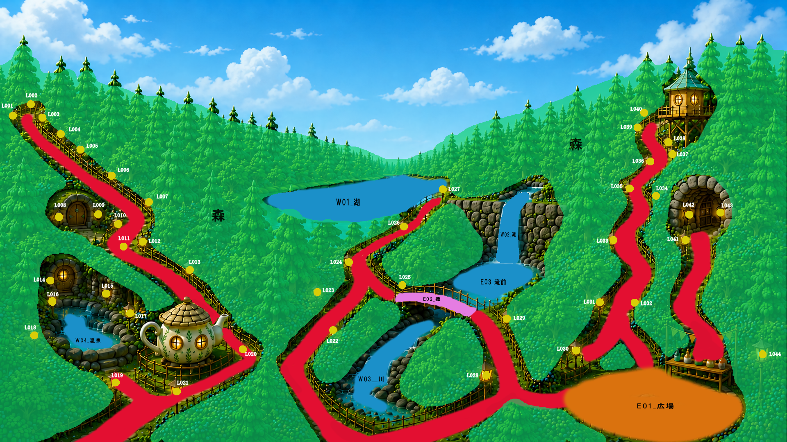

# TeaMerry Forest Master Map

## 基準マップID

Forest_Master_Map_v1

※ TeaMerry Forest の全イベント配置・キャラクター移動・ランタン管理は、このマップIDを基準に管理する。
※ 画像ファイルは `Forest_Master_Map_v1.png` を使用する。

---

## マップ画像

---

## 地形分類

### 水域

* W01 湖
* W02 滝
* W03 川
* W04 温泉

### イベント

* E01 広場
* E02 橋
* E03 滝前
* E04 展望台
* E05 ティーポット前

### ランタン

* L001 ～ L044

### 森林

* 森エリアは鳥・フクロウ・ミノムシ出現領域とする。

### 歩行エリア

* 赤色で示された道のみキャラクター移動可能。
